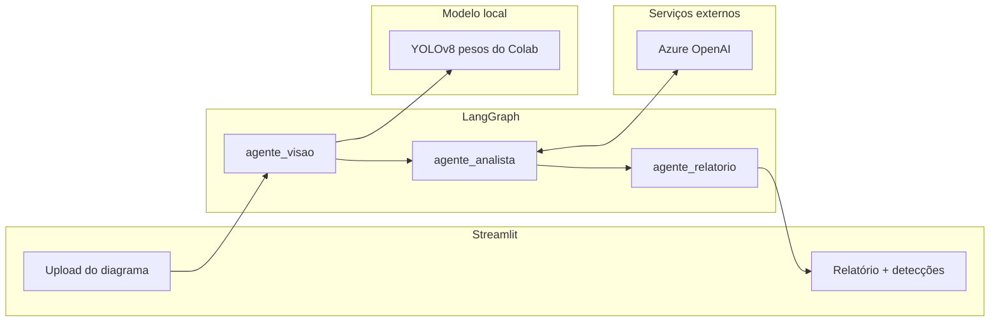

# ThreatMap — Modelagem de Ameaças com IA (FIAP Hackathon, Fase 5)

Pipeline multiagente alinhado ao Hackathon FIAP (IADT Fase 5): recebe um
**diagrama de arquitetura em imagem**, identifica **componentes** com modelo
**supervisionado** (YOLOv8), gera **Relatório de Modelagem de Ameaças STRIDE**
com vulnerabilidades e contramedidas (Azure OpenAI) e interface Streamlit.

## Problema

O enunciado pede um MVP que valide a viabilidade de modelagem de ameaças
automática a partir de diagrama. No ThreatMap:

1. **Visão supervisionada** detecta componentes (usuários, APIs, serviços
   cloud, bancos…), não “ameaças” diretamente.
2. O **analista LLM** aplica STRIDE e propõe vulnerabilidades + contramedidas
   (riscos genéricos OWASP/cloud — sem inventar CVE).
3. O **relatório** consolida o entregável em markdown.

Diagramas de avaliação do PDF (Figura 1 AWS e Figura 2 Azure) estão em
`data/material-fiap/` e selecionáveis na UI.

## Arquitetura



O estado compartilhado (`src/state/estado_ameaca.py`) é um `TypedDict` que cada
nó atualiza parcialmente:

| Campo | Produzido por | Conteúdo |
|---|---|---|
| `caminho_imagem` | entrada | caminho do diagrama |
| `componentes_detectados` | visão | classes únicas detectadas |
| `deteccoes` | visão | classe, confiança e posição (x, y) |
| `imagem_anotada` | visão | imagem com bounding boxes |
| `analise_stride` | analista | ameaças + contramedidas por componente (S/T/R/I/D/E) |
| `vulnerabilidades` | analista | risco, severidade, categoria e contramedida |
| `relatorio_final` | relatório | markdown consolidado |

### Os três nós

1. **`src/nodes/agente_visao.py`** — roda YOLOv8 local com os pesos treinados
   no Colab (dataset de diagramas de arquitetura), filtra por confiança e
   salva a imagem anotada.
2. **`src/nodes/agente_analista.py`** — envia componentes e posições ao
   Azure OpenAI com prompt STRIDE estruturado e faz o parse do JSON
   (ameaça + contramedida por categoria, vulnerabilidades priorizadas).
3. **`src/nodes/agente_relatorio.py`** — consolida tudo em markdown
   determinístico (template Python, sem LLM): resumo executivo, componentes,
   matriz STRIDE, vulnerabilidades priorizadas, contramedidas e limitações.
   Também salva em `data/outputs/relatorio.md`.

O grafo (`src/graph.py`) é linear: `visao → analista → relatorio`.

## Treino do modelo (Google Colab)

O script `scripts/train_yolo_google_colab.py` replica o notebook Colab:

1. Baixa o dataset Kaggle `carlosrian/software-architecture-dataset`
   (imagens de arquitetura **já anotadas** em XML)
2. Converte as anotações XML → labels YOLO e gera `data.yaml`
   (pipeline de preparação exigido pelo enunciado)
3. Treina `yolov8n` por 50 epochs
4. Salva em `Drive/yolov8_training_results/software_architecture_model/`

Depois do treino, copie o arquivo de pesos para o projeto:

```text
Drive/.../software_architecture_model/weights/best.pt
  → models/software_architecture_model/weights/best.pt
```

## Como rodar

Requisitos: Python 3.12+, pesos YOLO locais e chave do Azure OpenAI.

```powershell
# 1. Criar e ativar o ambiente virtual
python -m venv venv
.\venv\Scripts\activate

# 2. Instalar dependências
pip install -r requirements.txt

# 3. Configurar chaves e pesos
copy .env.example .env
# edite o .env com suas chaves Azure
# copie best.pt para models/software_architecture_model/weights/

# 4a. Interface web
streamlit run streamlit_app.py

# 4b. Ou via linha de comando
python -m src.main -v                       # diagrama de exemplo
python -m src.main caminho\diagrama.png -v  # seu diagrama
```

Testes rápidos por nó:

```powershell
python -m src.nodes.agente_visao       # só a visão (requer best.pt)
python -m src.nodes.agente_analista    # só o analista (requer Azure OpenAI)
python -m src.nodes.agente_relatorio   # só o relatório (offline)
python tests\smoke_yolo_detector.py
```

## Variáveis de ambiente (`.env`)

| Variável | Descrição |
|---|---|
| `AZURE_OPENAI_API_KEY` | Chave do recurso Azure OpenAI |
| `AZURE_OPENAI_ENDPOINT` | Endpoint do recurso (`https://<recurso>.openai.azure.com`) |
| `AZURE_OPENAI_DEPLOYMENT` | Nome do deployment (ex.: `gpt-4o-mini`) |
| `AZURE_OPENAI_API_VERSION` | Versão da API (padrão `2024-08-01-preview`) |
| `YOLO_WEIGHTS_PATH` | Opcional: caminho para `best.pt` |
| `YOLO_CONF` | Opcional: limiar de confiança do YOLO (padrão `0.25`) |

> **Azure:** nomes legados `AZURE_OPENAPI_KEY` / `AZURE_OPENAPI_BASE_URL` ainda funcionam.

> Importante: é preciso **criar o deployment** no Azure AI Foundry com o mesmo
> nome configurado em `AZURE_OPENAI_DEPLOYMENT`; sem ele o analista registra o
> erro no estado e o relatório sai sem a matriz STRIDE.

## Decisão: treino local (Colab) + inferência local

O dataset é preparado e o YOLOv8n é treinado no **Google Colab** (GPU). Os
pesos (`best.pt`) entram no projeto e a inferência roda **offline** via
Ultralytics — sem Roboflow nem API de visão externa.

## Limitações conhecidas

- A qualidade da detecção depende do dataset/treino; as Figuras 1 e 2 do PDF
  estão cobertas pelo vocabulário do modelo, mas diagramas fora das classes
  podem retornar poucos componentes.
- Labels do dataset (ex.: `sass_services`) são preservados no estado; a UI e o
  relatório aplicam aliases de exibição quando faz sentido.
- A análise STRIDE é assistida por LLM (riscos genéricos OWASP/cloud), sem
  consulta live a NVD/CVE. Não substitui revisão humana.
- O pipeline é um MVP linear; RAG de vulnerabilidades fica como melhoria futura.
- Fluxos/setas do diagrama não são detectados — o fluxo é estimado por (x, y).

## Estrutura do projeto

```
├── streamlit_app.py          # Interface web
├── scripts/
│   ├── train_yolo_google_colab.py  # Script de treino Colab (referência)
│   └── train_yolo.py               # Variante local de treino
├── models/
│   └── software_architecture_model/weights/  # coloque best.pt aqui
├── src/
│   ├── main.py               # CLI do pipeline
│   ├── graph.py              # StateGraph (LangGraph)
│   ├── state/estado_ameaca.py
│   ├── nodes/
│   │   ├── agente_visao.py
│   │   ├── agente_analista.py
│   │   └── agente_relatorio.py
│   └── vision/yolo_detector.py  # inferência YOLO local
├── tests/smoke_yolo_detector.py
├── data/
│   ├── material-fiap/        # PDF do hackathon + Figuras 1/2 de avaliação
│   └── outputs/              # imagens anotadas e relatórios gerados
├── requirements.txt
└── .env.example
```
